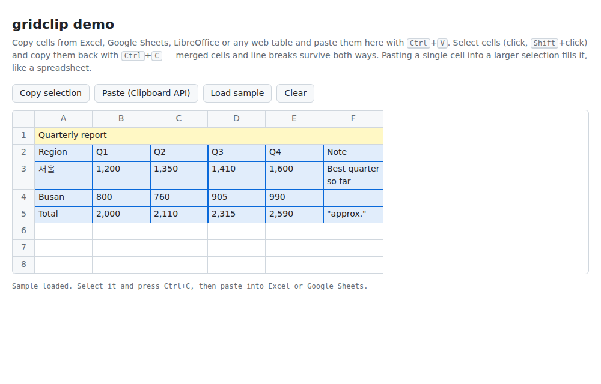

# gridclip

**웹 앱을 위한 스프레드시트 수준의 복사·붙여넣기.** 사용자가 Excel, Google 스프레드시트, LibreOffice, Word, 웹 페이지에서 복사한 셀을 그대로 읽어 옵니다. 병합된 셀, 셀 안의 줄바꿈, 공백까지 그대로입니다. 반대로 앱에서 복사한 셀도 이런 프로그램에 붙여넣으면 원래 모양 그대로 들어갑니다.

[](./LICENSE)


[English README](./README.md)

```js
import { parseClipboard, setClipboardData } from 'gridclip';

grid.addEventListener('paste', (event) => {
  const { rows, merges } = parseClipboard(event); // string[][] + 병합 셀
  // …선택한 셀부터 rows를 표에 써 넣기
});

grid.addEventListener('copy', (event) => {
  setClipboardData(event, selectedCells, { merges }); // TSV + HTML 표
});
```



---

## 왜 필요한가요?

데이터 그리드, 관리자 화면, 스프레드시트 같은 UI를 만들다 보면 결국 같은 버그 제보를 받게 됩니다.

- **"엑셀에서 붙여넣었더니 줄바꿈이 있는 셀이 두 행으로 쪼개져요."** TSV는 줄바꿈이 있는 셀을 따옴표로 감싸는데, `text.split('\n')`은 이를 모릅니다.
- **"병합된 셀이 밀려서 들어와요."** 병합 정보는 클립보드의 **HTML** 형식에만 있습니다. 그리고 `<td rowspan=2 colspan=3>`를 격자 좌표로 바꾸려면 HTML 표 알고리즘 전체가 필요합니다.
- **"앱에서 복사해 엑셀에 붙이면 한 열로 다 들어가거나, 줄바꿈이 행으로 갈라지거나, 한글이 깨져요."** 엑셀에는 정해진 TSV 따옴표 규칙이 필요합니다. 셀 안 줄바꿈은 `<br style="mso-data-placement:same-cell">`로 써야 하고, HTML에는 문자 집합 선언도 있어야 합니다.
- **"구글 시트처럼 값 하나를 범위에 붙이면 범위가 채워졌으면 좋겠어요."**

gridclip은 이 왕복 과정 전체를 작고 의존성 없는 라이브러리 하나로 해결합니다. DOM이 필요 없어서 브라우저와 서버 **모두**에서 동작합니다.

## 기능

- **실제로 붙여넣는 데이터를 읽습니다.** Excel, Google 스프레드시트, LibreOffice Calc, Word, 웹 페이지는 각각 테스트 픽스처로 검증합니다. 이 밖에도 TSV나 HTML 표를 클립보드에 넣는 앱이라면 다 읽습니다. Numbers, Notion, Airtable, 다른 데이터 그리드, 일반 텍스트 등이 해당합니다.
- **병합 셀.** DOM 없이 HTML 표 모델 전체를 구현했습니다. 다음을 모두 처리합니다.
  - `colspan`/`rowspan`, `rowspan="0"`
  - 생략된 `<tr>`/`<tbody>`
  - 행 그룹 경계에서 잘리는 span
  - 중첩된 표, 닫히지 않은 태그

  엑셀 특유의 동작도 처리합니다. `mso-ignore:colspan`으로 넘쳐 보이는 텍스트는 병합으로 보지 않고, 숨겨진 `supportMisalignedColumns` 행은 건너뛰며, `mso-spacerun` 공백은 유지합니다.
- **두 형식의 장점만 결합합니다.** TSV와 HTML 표의 모양이 같으면 셀 값은 공백까지 정확한 TSV에서 가져오고, 병합은 HTML에서 가져옵니다. 모양이 다르면 HTML을 씁니다. 리치 텍스트 앱은 일반 텍스트에서 셀 안 줄바꿈을 행 구분으로 써 버리기 때문입니다.
- **다시 붙여넣어도 정확한 클립보드 데이터를 씁니다.** 따옴표 규칙을 지킨 TSV와 HTML 표를 함께 씁니다. HTML 표에는 병합, 셀 안 줄바꿈, 공백 보존, `<meta charset="utf-8">`이 들어갑니다. 그래서 Windows용 엑셀에서도 한글이 깨지지 않고, Excel, 스프레드시트, LibreOffice, Word, 리치 텍스트 에디터에 그대로 붙습니다.
- **클립보드 API와 대체 경로.** `copy`/`cut`/`paste` 이벤트(DOM, React), Async Clipboard API, `execCommand('copy')` 대체 경로, `writeText`를 지원합니다.
- **스프레드시트식 붙여넣기.** `applyPaste`는 붙여넣을 블록을 더 큰 선택 범위에 반복해서 채웁니다(값 하나로 범위 채우기, 1×2 블록을 3×4 범위에 반복 등). 격자를 늘리거나 가장자리에서 자르며, 원본 데이터는 절대 바꾸지 않습니다.
- **악의적인 입력에도 안전합니다.** 모든 파서가 선형 시간에 동작합니다. 몇 바이트짜리 `<td colspan=1000>`을 반복하는 "붙여넣기 폭탄"은 `maxCells` 제한으로 막습니다.
- **작고 트리 셰이킹됩니다.** 의존성이 없고 ESM, CommonJS, `<script>` 빌드와 TypeScript 타입을 모두 제공합니다. 전체가 min+gzip 10.8 kB이고, `parseTSV`/`stringifyTSV`만 쓰면 1.4 kB입니다.

## 설치

```sh
npm install gridclip
# 또는: pnpm add gridclip · yarn add gridclip · bun add gridclip
```

Deno에서는 `import { parseClipboard } from 'npm:gridclip';`로 가져옵니다.

번들러 없이 쓸 때:

```html
<script src="https://unpkg.com/gridclip"></script>
<script>
  const { parseClipboard } = window.gridclip;
</script>
```

## 빠른 시작

### 그리드에 붙여넣기

```js
import { parseClipboard, applyPaste } from 'gridclip';

document.addEventListener('paste', (event) => {
  if (document.activeElement !== gridElement) return;
  const { rows } = parseClipboard(event);
  if (rows.length === 0) return; // 예: 이미지를 붙여넣은 경우
  event.preventDefault();

  // selection = 선택 범위 { row, col, rows, cols }
  const { grid, range } = applyPaste(data, rows, selection);
  data = grid;           // 새 배열 (기존 배열은 그대로)
  select(range);         // 실제로 쓰인 영역
});
```

> 클립보드 이벤트는 포커스된 요소가 편집 가능할 때만 그 요소로 전달됩니다. 셀이 편집 불가능한 그리드라면 위 예제처럼 `document`에서 이벤트를 받고 그리드에 포커스가 있는지 확인하세요. (선택 영역이 없으면 Firefox는 `copy`/`cut` 이벤트를 포커스된 요소가 아니라 `<body>`로 보냅니다.)

### 그리드에서 복사하기

```js
import { setClipboardData, sliceGrid } from 'gridclip';

document.addEventListener('copy', (event) => {
  if (document.activeElement !== gridElement) return;
  setClipboardData(event, sliceGrid(data, selection)); // preventDefault()까지 호출
});
```

### 버튼으로 복사·붙여넣기

```js
import { copyToClipboard, readFromClipboard } from 'gridclip';

copyButton.onclick = async () => {
  const method = await copyToClipboard(rows, { merges }); // 'clipboard-api' | 'exec-command' | 'write-text'
};

pasteButton.onclick = async () => {
  const { rows, merges } = await readFromClipboard(); // 브라우저가 권한을 물어볼 수 있습니다
};
```

### React

React의 합성 클립보드 이벤트를 그대로 넘기면 됩니다.

```jsx
function Grid({ data, selection, onChange }) {
  return (
    <div
      tabIndex={0}
      onCopy={(e) => setClipboardData(e, sliceGrid(data, selection))}
      onPaste={(e) => {
        const { rows } = parseClipboard(e);
        if (!rows.length) return;
        e.preventDefault();
        onChange(applyPaste(data, rows, selection).grid);
      }}
    >
      {/* … */}
    </div>
  );
}
```

### Vue

```vue
<div tabindex="0" @copy="setClipboardData($event, sliceGrid(data, selection))" @paste="onPaste">…</div>
```

### 서버에서

`copyToClipboard`와 `readFromClipboard`를 뺀 모든 함수는 순수 함수입니다. Node, Deno, Bun, 워커, 엣지 런타임에서 동작하므로, 예를 들어 클라이언트가 보낸 HTML이나 TSV를 서버에서 가져올 때 쓸 수 있습니다.

```js
import { parseHTMLTable, parseTSV } from 'gridclip';

const table = parseHTMLTable(htmlFromClient, { maxCells: 100_000 });
const rows = parseTSV(csvText, { delimiter: ',' });
```

## 직접 해 보기

빌드한 뒤 데모를 여세요. 엑셀이나 구글 시트에서 붙여넣고, 다시 복사해 낼 수 있는 작은 스프레드시트입니다.

```sh
npm install && npm run build
npx http-server . -o examples/demo.html   # 아무 정적 서버나 괜찮습니다
```

## API

모든 함수는 인자를 검사합니다. 잘못된 입력에는 `gridclip:`으로 시작하는 메시지와 함께 `TypeError`나 `RangeError`를 던집니다.

| 함수 | 설명 |
| --- | --- |
| `parseClipboard(source, options?)` | 이벤트, `DataTransfer`, `{ text, html }`에서 붙여넣은 셀을 읽습니다 |
| `setClipboardData(target, grid, options?)` | `copy`/`cut` 핸들러 안에서 셀을 씁니다 |
| `copyToClipboard(grid, options?)` | 시스템 클립보드에 셀을 씁니다 (비동기) |
| `readFromClipboard(options?)` | 시스템 클립보드에서 셀을 읽습니다 (비동기) |
| `parseTSV(text, options?)` | 탭(또는 쉼표)으로 구분된 텍스트를 파싱합니다 |
| `stringifyTSV(grid, options?)` | 스프레드시트와 호환되는 TSV/CSV로 직렬화합니다 |
| `parseHTMLTable(html, options?)` | HTML의 첫 번째 `<table>`을 병합 정보와 함께 추출합니다 |
| `stringifyHTMLTable(grid, options?)` | HTML 표로 직렬화합니다 |
| `stringifyClipboard(grid, options?)` | 두 형식을 한 번에 만듭니다: `{ text, html }` |
| `applyPaste(grid, data, options?)` | 스프레드시트 방식으로 블록을 격자에 붙여넣습니다 |
| `sliceGrid(grid, range, fill?)` | 격자에서 사각형 영역을 복사합니다 |

```ts
type Grid<T = string> = T[][];
interface MergeRange { row: number; col: number; rowSpan: number; colSpan: number } // 0부터 시작
interface CellRange { row: number; col: number; rows: number; cols: number }
```

### `parseClipboard(source, options?)`

반환값은 `{ rows: string[][], merges: MergeRange[], source: 'html' | 'text' | 'none' }`입니다.

- `rows`는 항상 직사각형입니다.
- 파일이나 이미지처럼 텍스트가 없으면 `rows`가 비어 있고 `source`는 `'none'`입니다.
- `source`는 셀 **값**을 가져온 형식을 뜻합니다. 병합은 항상 HTML에서 가져옵니다.

`parseTSV`와 `parseHTMLTable`의 모든 옵션을 받고, 다음 옵션이 더 있습니다.

| 옵션 | 기본값 | |
| --- | --- | --- |
| `prefer` | `'auto'` | 아래 설명 참고 |

`prefer`의 동작:

- `'auto'`: HTML에 표만 있을 때(스프레드시트가 넣는 형태)만 HTML 표를 씁니다.
  - 표 모양이 일반 텍스트와 같으면 값은 텍스트에서, 병합은 HTML에서 가져옵니다.
  - 모양이 다르면 HTML에서 모두 가져옵니다.
  - 웹 페이지에서 문단과 표를 함께 선택했을 때처럼 HTML에 다른 내용도 있으면, 사용자가 실제로 선택한 텍스트를 씁니다.
- `'html'`: HTML 표가 있으면 항상 그 표를 씁니다.
- `'text'`: 텍스트가 있으면 항상 텍스트를 씁니다.

어느 모드든 원하는 형식이 없으면 다른 형식을 씁니다. `cell` 매퍼를 넘기면 속성 정보가 HTML에 있으므로 값을 HTML에서 읽습니다.

### `setClipboardData(target, grid, options?)`

`copy`/`cut` 핸들러 안에서 `text/plain`(TSV)과 `text/html`(표)을 쓰고 `event.preventDefault()`를 호출합니다. `target`에는 이벤트(DOM 또는 React)나 그 `DataTransfer`를 넘깁니다.

### `copyToClipboard(grid, options?)`

클릭이나 키 입력 같은 사용자 동작 안에서 호출하세요. 다음 순서로 시도하고, 성공한 방법을 돌려줍니다.

1. `ClipboardItem`과 `navigator.clipboard.write()`로 두 형식 모두 쓰기
2. `document.execCommand('copy')`로 두 형식 모두 쓰기. 오래된 브라우저나 `http:` 페이지용이며, 쓰고 난 뒤 기존 선택 영역과 포커스를 복원합니다
3. `navigator.clipboard.writeText()`로 텍스트만 쓰기

모두 실패하면 브라우저의 오류를 `cause`에 담은 `Error`로 reject합니다.

### `readFromClipboard(options?)`

`navigator.clipboard.read()`로 읽고, 안 되면 `readText()`로 읽은 뒤 `parseClipboard`처럼 파싱합니다. 보안 컨텍스트(HTTPS)가 필요합니다.

### `parseTSV(text, options?)` / `stringifyTSV(grid, options?)`

스프레드시트가 쓰는 규칙 그대로 TSV를 다룹니다.

- `"`로 시작하는 셀은, 닫는 따옴표 바로 뒤가 구분자나 줄바꿈이나 입력의 끝일 **때만** 따옴표를 벗깁니다(`""` → `"`). 그래서 `5" ruler`나 `"Hi" she said` 같은 텍스트는 그대로 남습니다.
- 마지막 줄바꿈 하나는 무시합니다. 엑셀은 마지막 행 뒤에도 줄바꿈을 붙이기 때문입니다.
- 맨 앞의 BOM은 제거합니다.

`parseTSV(stringifyTSV(grid))`는 어떤 직사각형 문자열 격자든 원래 `grid`를 그대로 돌려줍니다(속성 기반 테스트로 검증).

옵션은 다음과 같습니다.
- `delimiter`: 기본 `'\t'`. CSV는 `','`.
- `rectangular`: 기본 `true`.
- `normalizeNewlines`: 기본 `true`.
- `lineEnding`: 기본 `'\n'`.
- `trailingNewline`: 기본 `false`.

### `parseHTMLTable(html, options?)` / `stringifyHTMLTable(grid, options?)`

`parseHTMLTable`은 첫 번째 `<table>`을 `{ rows, merges }`로 추출하고, 표가 없으면 `null`을 돌려줍니다. 셀 텍스트는 사용자가 화면에서 보는 그대로입니다.

- CSS white-space 규칙을 따릅니다.
- `<br>`과 블록 요소는 줄바꿈이 됩니다.
- 숨겨진 내용은 건너뜁니다.
- 중첩된 표는 셀 안의 텍스트로 펼칩니다.

옵션은 다음과 같습니다.
- `mergedCells`: `'empty'`(기본) 또는 `'repeat'`.
- `preserveNbsp`: 기본 `false`.
- `cell`: 셀 값 바꾸기.
- `maxCells`: 기본 `5_000_000`.

**원본 값 읽기.** 스프레드시트는 셀에 서식이 적용된 텍스트(`1,234.50`)를 넣지만, 원본 값을 속성으로 붙여 두는 경우가 많습니다.

```js
// Excel: <td x:num="1234.5">1,234.50</td>
parseHTMLTable(html, { cell: ({ attributes }) => attributes['x:num'] || undefined });

// Google 스프레드시트: <td data-sheets-value='{"1":3,"3":1234.5}'>$1,234.50</td>
parseHTMLTable(html, {
  cell: ({ attributes }) => {
    const raw = attributes['data-sheets-value'];
    if (!raw) return undefined;
    const value = JSON.parse(raw);
    return String(value['3'] ?? value['2'] ?? value['4']);
  },
});
```

`stringifyHTMLTable`이 만드는 HTML:
- 마크업을 이스케이프합니다.
- 줄바꿈은 엑셀이 셀 안에 유지하는 `<br style="mso-data-placement:same-cell">`로 씁니다.
- 공백이 의미 있는 셀에는 브라우저와 편집기를 위해 `white-space:pre-wrap`을 붙입니다.
- HTML에서 접히는 공백(앞뒤 공백, 연속 공백)은 Excel과 같은 방식인 `<span style="mso-spacerun:yes">&nbsp;…</span>`으로도 씁니다. Excel은 붙여넣을 때 CSS `white-space`를 무시하지만 이 표기는 일반 공백으로 되살립니다.

> **Excel에 붙여넣기.** Excel은 HTML 형식을 읽습니다. 병합, 셀 안 줄바꿈, 앞뒤·연속 공백, 따옴표, 한글, 이모지는 그대로 들어갑니다(Windows용 Excel로 확인). 다음 두 가지는 Excel이 정합니다. 셀 안의 탭은 공백이 됩니다(Excel은 붙여넣은 HTML의 탭을 버리며, Excel 자신이 만든 HTML도 마찬가지입니다). 값은 직접 입력한 것처럼 해석됩니다. `001234`는 숫자 1234, `=1+1`은 수식, `1,234.50`은 서식 있는 숫자가 됩니다. 또 Windows용 Excel(Microsoft 365)은 숨긴 행을 두 형식 모두에서 빼고 복사합니다.
- `<meta charset="utf-8">`을 앞에 붙입니다.

옵션: `merges`, `headerRows`.

### `applyPaste(grid, data, options?)`

**새** 격자와 실제로 쓰인 영역을 `{ grid, range }`로 돌려줍니다. 입력은 바꾸지 않습니다.

옵션은 다음과 같습니다.
- `row`, `col`: 붙여넣기 시작 셀.
- `rows`, `cols`: 선택 범위 크기. 가로세로 모두 블록 크기의 배수이면 블록을 반복해서 채웁니다.
- `grow`: 격자 확장 여부. `true`(기본), `false`(가장자리에서 자르기), `'rows'`, `'cols'` 중 하나.
- `fill`: 새로 생긴 칸에 넣을 값. 기본 `''`.

```js
applyPaste([['a', 'b'], ['c', 'd']], [['X']], { rows: 2, cols: 2 }).grid; // [['X','X'],['X','X']]
```

### `sliceGrid(grid, range, fill?)`

`range = { row, col, rows, cols }` 영역을 복사합니다. 격자 밖의 칸은 `fill`(기본 `''`)로 채웁니다.

## 호환성

| 환경 | 지원 |
| --- | --- |
| Chrome / Edge / Opera | 전체 기능. 자동화된 브라우저 테스트(Chromium, Linux와 Windows)로 검증합니다. |
| Firefox | 전체 기능. 실제 시스템 클립보드를 포함해 같은 자동화 브라우저 테스트로 검증합니다. |
| Safari | 파싱과 직렬화는 순수 JavaScript라 어디서나 똑같이 동작하며, HTML 파서는 WebKit의 파서·표 레이아웃과 대조합니다. 클립보드 호출은 기능을 감지해서 고릅니다. `ClipboardItem`이 있으면(Firefox 127+, Safari 13.1+) `navigator.clipboard.write()`로, 없으면 `execCommand('copy')`로 두 형식을 모두 씁니다. Safari에서는 클릭 핸들러 안에서 바로 호출하세요. |
| `http:` 페이지 | `copy`/`paste` 이벤트와 `copyToClipboard`(`execCommand` 경유)는 동작합니다. `readFromClipboard`는 HTTPS가 필요합니다. |
| Node.js 14+, Deno, Bun, 워커, 엣지 | 순수 함수(파싱, 직렬화, `applyPaste`)는 모두 동작합니다. 비동기 클립보드 함수 두 개는 이유를 알려 주는 오류로 reject합니다. |
| TypeScript | ESM과 CommonJS 타입을 모두 제공하며, `node10`/`node16`/`bundler` 해석 모두 지원합니다. |

## 테스트

`npm run check`로 아래를 모두 실행합니다.

- **단위 테스트**(Vitest): 약 320개 케이스입니다. Windows용 Excel, Google 스프레드시트, LibreOffice, Word, 웹 페이지 표를 본뜬 클립보드 HTML 픽스처와, 실제 Windows용 Excel에서 캡처한 클립보드 데이터([test/fixtures/REAL-CAPTURES.md](./test/fixtures/REAL-CAPTURES.md))를 포함하며, 라인 커버리지는 100%입니다.
- **속성 기반 테스트**(fast-check):
  - 고립된 서로게이트, 제어 문자, 따옴표, 탭, 줄바꿈을 포함한 임의의 유니코드로 TSV와 HTML 왕복을 검증합니다.
  - 퍼징으로 충돌이 없는지, 그리고 결과가 직사각형인지와 병합이 겹치지 않는지를 확인합니다.
  - `applyPaste`는 참조 모델과 비교합니다.
- **Chromium·Firefox·WebKit 대조 테스트**: 생성한 입력을 gridclip과 브라우저가 각각 파싱한 뒤 결과를 비교합니다. 매번 수만 건을 비교합니다. gridclip은 Chromium과 정확히 일치하며, 다른 엔진에서는 문서화된 엔진 차이만 허용하고 그 건수를 보고합니다(스프레드시트가 만들지 않는 겹치는 셀, Firefox `innerText`의 줄 끝 공백 하나. WebKit `innerText`는 자기 레이아웃과도 달라 비교에 쓰지 않습니다).
  - 셀 위치와 span은 실제 레이아웃과 비교합니다.
  - 퍼징한 잘못된 마크업은 브라우저의 트리 빌더와 비교합니다.
  - 문자 참조는 텍스트와 속성에서 비교합니다.
  - 셀 텍스트는 `innerText`와 비교합니다.
- **E2E 테스트**: Chromium과 Firefox에서 실제 시스템 클립보드로 확인합니다(Playwright는 WebKit에 클립보드 접근 권한을 줄 수 없어 WebKit에서는 브라우저 자체의 텍스트 붙여넣기만 확인하며, Safari는 직접 확인합니다). 엔진 하나만 돌리려면 `npm run test:browser:firefox`(또는 `:chromium`, `:webkit`)를 쓰고, 브라우저는 `npx playwright install chromium firefox webkit`으로 설치합니다. 키보드 복사·붙여넣기, 잘라내기, `<textarea>`와 `contenteditable`에 붙여넣기, Async Clipboard API, `execCommand`/`writeText` 대체 경로를 확인하고, 데모 앱도 사용자처럼 조작해 봅니다.
- **런타임·패키징**:
  - 빌드된 ESM/CommonJS 패키지를 Node 14·16·18·20·22·24, Bun, Deno에서 스모크 테스트합니다.
  - 배포되는 타입 선언을 `node10`/`node16`/`bundler` 해석 방식으로 각각 컴파일해 봅니다.
  - `publint`와 `@arethetypeswrong/cli`로 패키지 구성을 검사합니다.

## 라이선스

[MIT](./LICENSE)
